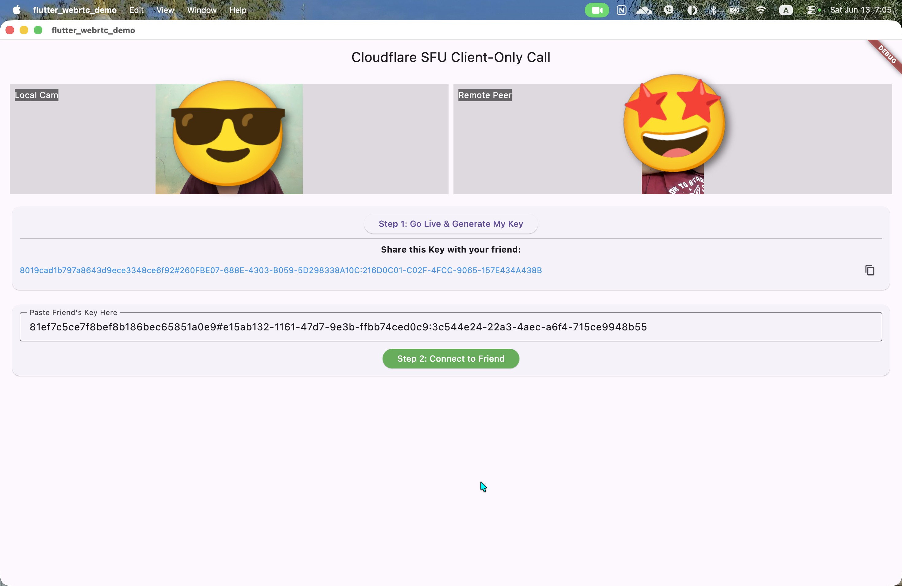

# Flutter WebRTC Demo


<br>

# TODO
- [ ] Peer Discovery
- [ ] Signaling Server
- [ ] Group Call

# Environment Variables
Get ```CLOUDFLARE_ACCOUNT_ID``` and ```CLOUDFLARE_ACCESS_TOKEN``` from [Cloudflare SFU](https://developers.cloudflare.com/realtime/sfu/get-started/) and set them in ```.env``` file.

# Testing Purpose
For testing purpose, we call cloudflare rtc endpoints from flutter app. In real world application, we should handle these calls from our own backend server.